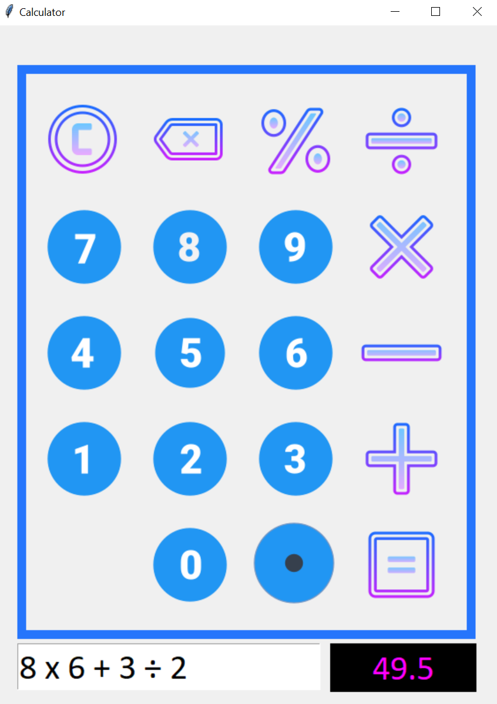
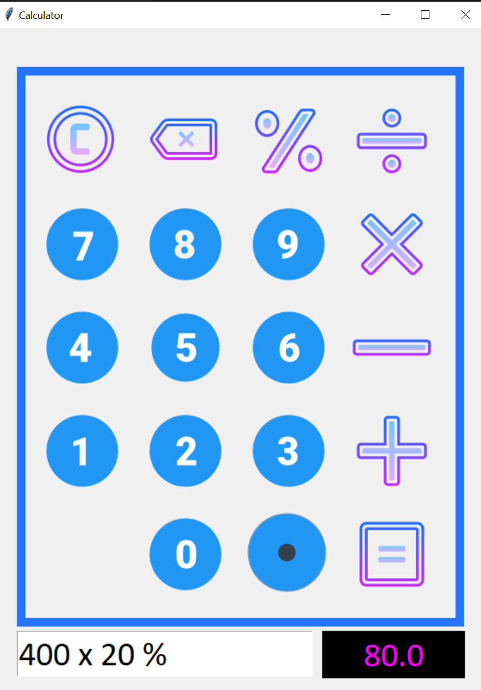
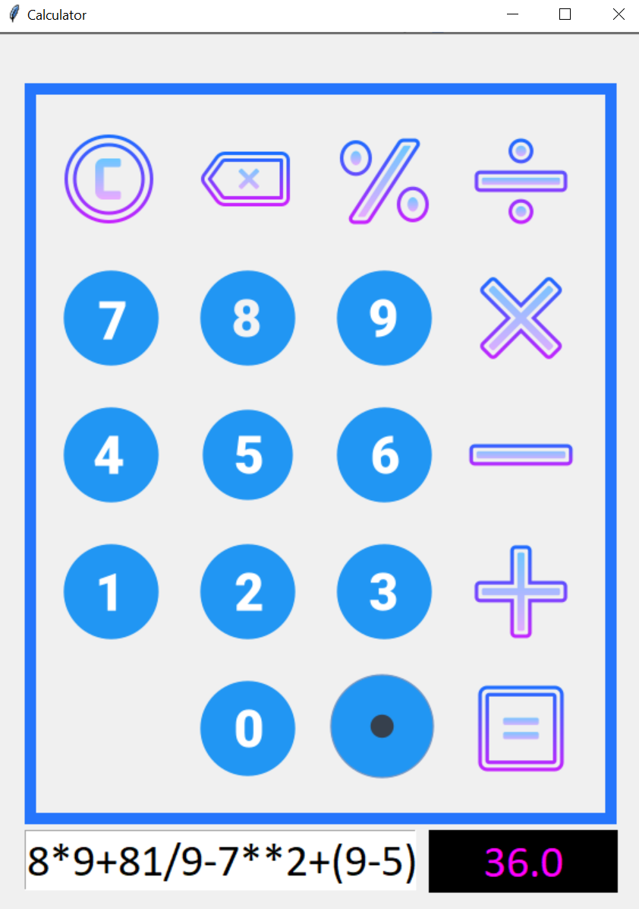

# Calculator GUI
 
 **Simple GUI calculator made with Python and Tkinter.**
 
 ## Author
 
 - [Ravi Kumar](https://github.com/Raviprabhat527)
 
 ## Screenshots
 
 

     
 

 
 

     
 

 
     &nbsp;&nbsp;&nbsp;
     

 

     
     
 

 
 ## Badges
